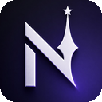

<p align="center">
  
</p>

<h1 align="center">nevos trading extension lite</h1>

<p align="center">
  Readable source for the client-side Roblox trading browser extension.
</p>

<p align="center">
  <a href="https://nevos-extension.com">Website</a> -
  <a href="https://www.youtube.com/watch?v=_KB9yUQk95I">YouTube</a> -
  <a href="https://discord.gg/tHReJPn2q5">Discord</a>
</p>

<p align="center">
  <a href="https://discord.gg/tHReJPn2q5">
    
  </a>
  <a href="https://discord.gg/tHReJPn2q5">
    
  </a>
</p>

Release builds stay minified. This repo keeps the readable source, manifests, and assets.

## What It Is

nevos trading extension lite is a client-side Roblox trading extension for Chrome, Brave, Edge, Opera, Firefox, and Safari. It talks only to Roblox and Rolimons — no private backend, no third-party value proxies, no Discord webhooks.

Want the full feature set (trade history, analyze trade, trade ad alerts, proofs, and more)? Use the main extension: [nevos-trading-extension](https://github.com/NevoQF/nevos-trading-extension).

## Clone

```powershell
git clone https://github.com/NevoQF/nevos-trading-extension-lite.git
cd nevos-trading-extension-lite
```

## Features

### Values

- Rolimons values on trade windows, trade lists, catalog pages, and user pages.
- Profile inventory pill with a RAP or Value display toggle.
- Profile inventory overview with total value, total RAP, item count, item flags, demand, serials, and search/sort controls.
- Post-tax trade value and Robux tax difference helpers.
- RAP raise/drop indicators for items sitting over or under nearby value tiers.

### Trade Pages

- Trade win/loss stats with value and RAP deltas.
- Trade list values and color indicators.
- Trade list filters for all trades, overpay, equal, underpay, upgrade, downgrade, Robux, and item search.
- Hide-others button that focuses the selected trade while keeping the rest of the trade list available again with one click.
- Quick decline button on trade rows.
- Trade window item search.
- Duplicate trade warning.
- Counter trade prompt.
- Mobile trade items button.

### Notifications

- Inbound trade notifications (browser).
- Declined trade notifications.
- Completed trade notifications.

### Items And Profiles

- Rare item flags.
- Projected item flags.
- Item profile links.
- Item ownership history links.
- User profile links.
- User badge display.
- Quick item search from the Roblox navbar.

### Extra Tools

- Colorblind mode.
- Optional Roblox 2FA autofill with password-protected encrypted storage.
- Option to disable RAP in win/loss stats.
- Trade ad posting to Rolimons.
- Settings stored locally through browser storage.

## Source

The readable extension source is in `extension/`.

## Build (local)

From the repo root, after installing `terser` in this workspace (or setting `NTE_TERSER_PATH`):

```powershell
powershell -ExecutionPolicy Bypass -File "tools\build-release.ps1"
```

Outputs minified browser zips under `dist/`.

## Layout

```text
extension/            extension source
tools/                local release build scripts
```

## License

Source is shared for review and verification only. Official builds are free for personal use. Reuploading, rebranding, reselling, or claiming authorship is not allowed. See `LICENSE`.

## Author

Created by [NevoQF](https://github.com/NevoQF).

## Star

If this source helps you verify the extension or you like the project, a star on the repo helps.
